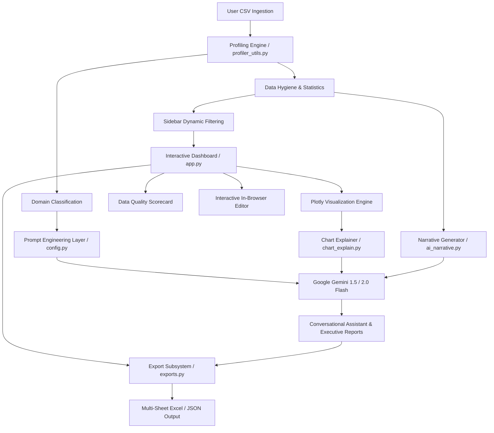

<div align="center">

# 📊 Enterprise BI Assistant
### Autonomous Data Profiling, Interactive Analytics & Domain-Aware AI Intelligence

[](https://www.python.org/)
[](https://streamlit.io/)
[](https://aistudio.google.com/)
[](https://plotly.com/)
[](https://www.docker.com/)
[](LICENSE)

<p align="center">
  <b>Transform raw tabular data into executive dashboards, statistical diagnostics, and contextual natural language business intelligence in seconds.</b>
</p>

</div>

---

## 📌 Executive Summary

The **Enterprise BI Assistant** is a full-stack, AI-powered Business Intelligence platform designed to bridge the gap between raw data ingestion and executive decision-making. By pairing a client-side profiling engine with Google Gemini's reasoning capabilities, the platform automatically detects dataset domain semantics, performs statistical audits, renders dynamic Plotly visualizations, and delivers actionable narrative reports.

---

## 🌟 Core Capabilities

### 1. ⚡ Automated Data Profiling & Statistical Diagnostics
- **Instant Metric Synthesis:** Real-time computation of row/column dimensions, memory footprint, sparsity/missingness ratios, and data type distribution.
- **Advanced Descriptive Analytics:** Generates comprehensive distribution statistics including mean, standard deviation, quartiles, median, variance, skewness, and kurtosis for all continuous variables.
- **Correlation Matrix:** High-performance Pearson correlation analysis with automated identification of strong collinear features.

### 2. 📈 Interactive Visual Analytics (Plotly Engine)
- **9 Specialized Chart Architectures:**
  - *Distribution:* Histograms, Box Plots, Violin Plots.
  - *Categorical & Composition:* Bar Charts, Donut/Pie Charts, Treemaps.
  - *Relational & Temporal:* Scatter Plots, Line/Area Charts, Correlation Heatmaps.
- **AI-Powered "Explain Chart":** On-demand contextual interpretation of any visual artifact, identifying outliers, trends, and business takeaways with sub-second response caching.

### 3. 🧠 Domain-Adaptive Generative AI Reasoning
- **Automated Domain Detection:** Intelligently classifies uploaded datasets into specific operational contexts (*Personal Finance*, *Sales & Revenue Operations*, *General Corporate Analytics*).
- **Specialized Expert Personas:** Adapts system prompts, analytical focus, and terminology based on the active domain classification.
- **Guided Exploration:** Generates 3 intelligent, clickable follow-up inquiry chips after every conversational response.

### 4. 📝 Executive Narrative & Strategic Briefing Engine
- Generates a 4-pillar structured executive report on demand:
  1. **Executive Summary:** High-level strategic overview of dataset scope and baseline KPIs.
  2. **Key Findings:** Core patterns, segment leaders, and revenue/operational drivers.
  3. **Anomalies & Business Risks:** Statistical variances, concentration risks, and outlier clusters.
  4. **Actionable Recommendations:** Strategic operational directives based on empirical evidence.

### 5. 🛡️ Data Quality & Integrity Assurance
- **Automated Anomaly Detection:** Scans for complete duplicates, zero-variance (constant) fields, high-cardinality flags, and IQR-based statistical outliers.
- **Data Health Scorecard:** Visual completeness gauges and missingness breakdown per attribute.
- **AI Remediation Guidance:** Generates deterministic cleaning and transformation recommendations.

### 6. 🔄 Multi-Format Export Engine
- **Enterprise Excel Workbooks (`.xlsx`):** Formatted, multi-tab workbooks containing Cleaned Data, Descriptive Statistics, Data Quality Audits, and Generated AI Narratives.
- **Structured JSON Schemas:** Standardized JSON dumps of profiling metrics and dataset schemas for API interoperability.

---

## 🏗️ Technical Architecture & Data Flow



---

## 🧰 Technology Stack

| Component | Technology | Purpose |
| :--- | :--- | :--- |
| **Web UI & State Management** | [Streamlit](https://streamlit.io/) `1.38+` | Reactive frontend, session state, interactive controls |
| **Data Processing & Profiling** | [Pandas](https://pandas.pydata.org/), [NumPy](https://numpy.org/), [SciPy](https://scipy.org/) | In-memory transformations, vector operations, statistical distributions |
| **Data Visualization** | [Plotly Graph Objects & Express](https://plotly.com/) | Responsive, hardware-accelerated interactive visualizations |
| **Generative Intelligence** | [Google GenAI SDK](https://github.com/google/google-genai) | LLM inference (`gemini-1.5-flash` / `gemini-2.0-flash`) |
| **Export Serialization** | `openpyxl`, `xlsxwriter` | Production Excel workbook creation with multi-sheet formatting |
| **Containerization** | [Docker](https://www.docker.com/) / [Docker Compose](https://docs.docker.com/compose/) | Isolated, reproducible production deployments |

---

## 📁 Repository Layout

```text
bi-assistant/
├── .streamlit/
│   └── config.toml          # Streamlit theme & server configuration
├── assets/                  # UI previews, architectural diagrams, & screenshots
├── docs/
│   ├── architecture.md      # Comprehensive architectural blueprints & data flow
│   └── design.md            # Technical specifications & design doc
├── ai_narrative.py          # LLM executive report & business narrative engine
├── app.py                   # Main Streamlit orchestration & UI application
├── chart_explain.py         # AI visual-to-text interpretation & prompt cache
├── config.py                # System personas, application settings, prompt constants
├── exports.py               # Enterprise Excel & JSON serialization utilities
├── profiler_utils.py        # Core profiling algorithms, stats calculations & quality engine
├── requirements.txt         # Production Python dependencies
├── Dockerfile               # Production multi-stage Docker container build
├── docker-compose.yml       # Production orchestration definition
└── README.md                # Project documentation
```

---

## 🚀 Getting Started

### Prerequisites
- **Python:** Version `3.10` or higher
- **API Access:** A valid [Google Gemini API Key](https://aistudio.google.com/)

---

### Local Environment Setup

1. **Clone the repository:**
   ```bash
   git clone https://github.com/AbhinayNakirikanti/BI-Assistant.git
   cd BI-Assistant
   ```

2. **Initialize a virtual environment:**
   ```bash
   # Linux / macOS
   python3 -m venv venv
   source venv/bin/activate

   # Windows (PowerShell)
   python -m venv venv
   .\venv\Scripts\Activate.ps1
   ```

3. **Install dependencies:**
   ```bash
   pip install --upgrade pip
   pip install -r requirements.txt
   ```

4. **Configure Secrets & API Credentials:**

   *Option 1 — Streamlit Secrets (Recommended):*
   Create `.streamlit/secrets.toml`:
   ```toml
   GEMINI_API_KEY = "AIzaSy..."
   ```

   *Option 2 — Environment Variables:*
   Create a `.env` file in the root directory:
   ```env
   GEMINI_API_KEY="AIzaSy..."
   ```

5. **Launch the platform:**
   ```bash
   streamlit run app.py
   ```
   The application will be accessible at `http://localhost:8501`.

---

### 🐳 Docker Deployment

The application includes an optimized, production-ready container definition.

#### Using Docker Compose:
```bash
# Set your API key in environment
export GEMINI_API_KEY="your-gemini-api-key"

# Build and start container in detached mode
docker-compose up --build -d
```

#### Using Docker CLI:
```bash
# Build Docker image
docker build -t bi-assistant:latest .

# Run container
docker run -d \
  -p 8501:8501 \
  -e GEMINI_API_KEY="your-gemini-api-key" \
  --name bi-assistant-app \
  bi-assistant:latest
```

---

## 🛡️ Security, Privacy & Token Optimization

- **Zero Data Ingestion by Third Parties:** Raw tabular records are never sent en masse to external models. Profiling, filtering, outlier detection, and statistical summaries are computed 100% locally in-memory.
- **Truncated Context Payloads:** When communicating with the Gemini API, only aggregated schema metadata, distribution parameters, and concise structural summaries are transmitted.
- **Deterministic Cache Layer:** Heavy analytical operations and recurring LLM prompts utilize MD5 fingerprint hashing (`@st.cache_data`) to prevent redundant API invocations and minimize token consumption.

---

## 🤝 Contribution Guidelines

We welcome contributions adhering to industry-standard engineering practices:

1. **Fork & Branch:** Create a dedicated branch from `main` (`git checkout -b feature/analytics-enhancement`).
2. **Type Safety & Documentation:** Ensure functions include type annotations and Google-style docstrings.
3. **Local Testing:** Test changes against diverse CSV schemas (e.g., temporal, sparse, categorical-heavy).
4. **Pull Request:** Submit a PR detailing the problem statement, technical changes, and validation screenshots.

---

## 📄 License

This software is released under the **MIT License**. For full terms, refer to the [LICENSE](LICENSE) file.
