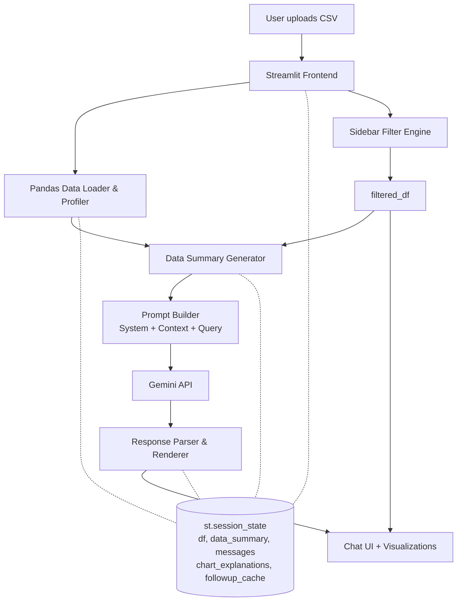
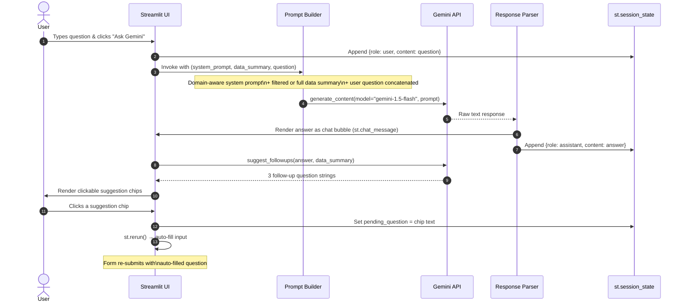

# Architecture

BI Assistant follows a linear pipeline that turns an uploaded CSV into a profiled dashboard and a grounded, natural-language Q&A experience, coordinated through Streamlit's session state.

## System Architecture — Component Flowchart

## Q&A Interaction — Sequence Diagram

This diagram shows the full message flow when a user asks a question in the AI Assistant tab.

## Component Overview

- **Streamlit Frontend** — renders the file uploader, KPI cards, charts, chat interface, and data editor.
- **Pandas Data Loader & Profiler** — reads the CSV into a dataframe and computes row/column counts, dtypes, and missing-value statistics.
- **Sidebar Filter Engine** — date-range and category filters that produce a `filtered_df`; all views use this filtered slice when active.
- **Data Summary Generator** (`build_summary`) — condenses the profiled dataframe into a compact text block (column details plus a small sample) suitable for an LLM prompt.
- **Prompt Builder** — combines the domain-aware system prompt, the data summary (filtered or full), and the user's question into a single dynamic prompt.
- **Gemini API** — the `gemini-1.5-flash` model generates grounded answers, chart explanations, follow-up suggestions, and data quality recommendations.
- **Response Parser & Renderer** — extracts the model's text response and displays it as a chat bubble.
- **Chart UI + Visualizations** — 9 Plotly chart types; each rendered chart includes a "💡 Explain chart" button powered by Gemini.
- **st.session_state** — persists `df`, `data_summary`, `messages`, `chart_explanations`, `followup_cache`, and `quality_rec_cache` across reruns.
- **`profiler_utils.py`** — `@st.cache_data` wrappers for heavy computations (correlation, quality stats, descriptive stats); domain detection; system-prompt factory.
- **`chart_explain.py`** — `explain_chart()` and `suggest_followups()` Gemini helpers with in-session dict caching.
